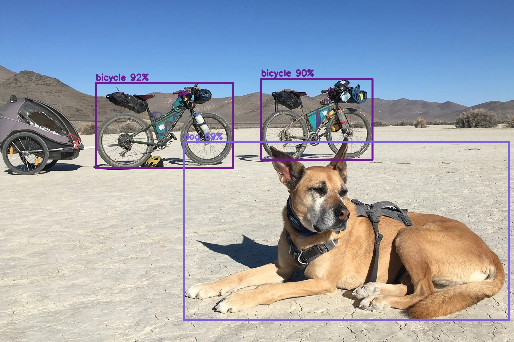

# YOLO Detector

Built for the [LFX Mentorship 2023 03-Sep-Nov Challenge - #2702](https://github.com/WasmEdge/WasmEdge/discussions/2702)
Using CV2 to:
- Load the weights
- Convert the pre-processed image to a blob
- Do a forward pass
- Apply non-maxima suppression to the predictions

|               |               |
| ------------- | ------------- |
|   |   |
|   |   |
|   |   |
|   |   |


## Required Packages
`apt-get install -y libopencv-dev `

## Python Functions to be ported to Rust
### Preprocessing:

`cv2.normalize` - To normalize images
    - potentially exists [opencvmini](https://github.com/second-state/opencvmini/blob/main/src/lib.rs#L39C20-L39C20)

`cv2.resize` - To Resize images
    - to be added to opencv mini ?
    - Could also be exposed via [imageops::resize](https://docs.rs/image/latest/image/imageops/fn.resize.html)

`cv2.dnn.blobFromImage` - convert image to blob for CV2

`cv2.dnn.readNet` - Loads network structure + pre-trained weights
    - This would need to accomadate a list of neural network formats (onnx, torch model, tflite ...)

### Post Processing:

`cv2.dnn.NMSBoxes`
    - potentially exists [media-pipe-nms](https://github.com/WasmEdge/mediapipe-rs/blob/7eee0492804661ccd76ba1da75c693f88c0ecc85/src/postprocess/processing/vision/non_max_suppression.rs#L107)

`rescale_boxes(boxes)`:

`extract_boxes(predictions)`

For drawing directly to input image
`cv2.getTextSize`

`cv2.putText`

`draw_detections(image, boxes, scores, class_ids)`
    - potentially exists [media-pipe-draw-detections](https://github.com/WasmEdge/mediapipe-rs/blob/7eee0492804661ccd76ba1da75c693f88c0ecc85/src/postprocess/utils/vision/draw_detections.rs#L9)


It potentially makes sense to have a single function to take the output tensor of the forward pass of a YOLO and process it into something that can be consumed by the program / applied directly to the image.
Something with a function signature:
```rust

fn process_yolo_tensor(tensor:YOLOTensor, conf_threshold: f64, iou_threshold: f64 ) -> HashSet<(BoundingBox,Class)>;
```

It could be comprised of all the post processing functions above, and the steps taken in the `process_output` function in the program.

### Helper Functions:
`cv2.imshow`
`cv2.waitKey`
`cv2.destroyAllWindows`
We may want to decouple this to the actual Yolo crate, as these functions will require peripherals and some idea of a windowing system.
So depending on the design of the YOLO Crate, it may make sense to put these elsewhere.

## Closing remarks
As much of this project as possible should leverage existing rust libraries that can target WASM
